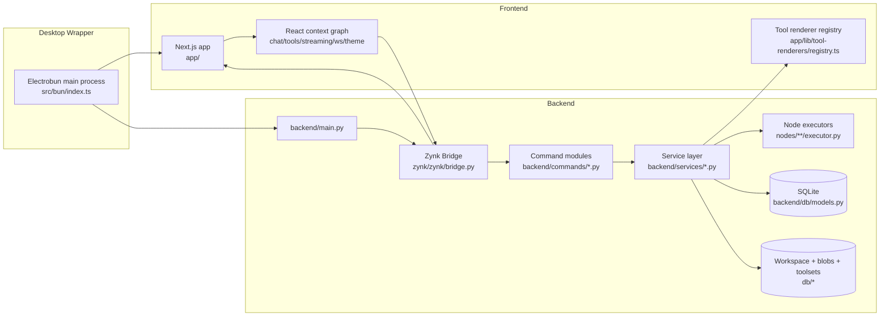
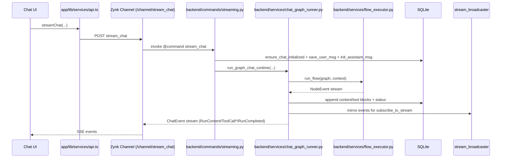
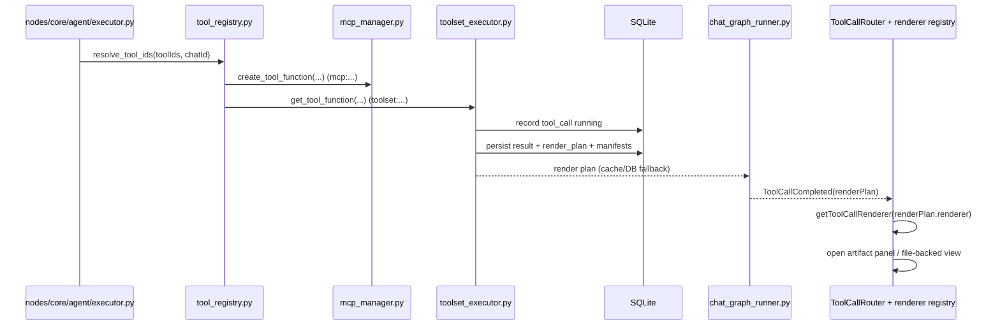
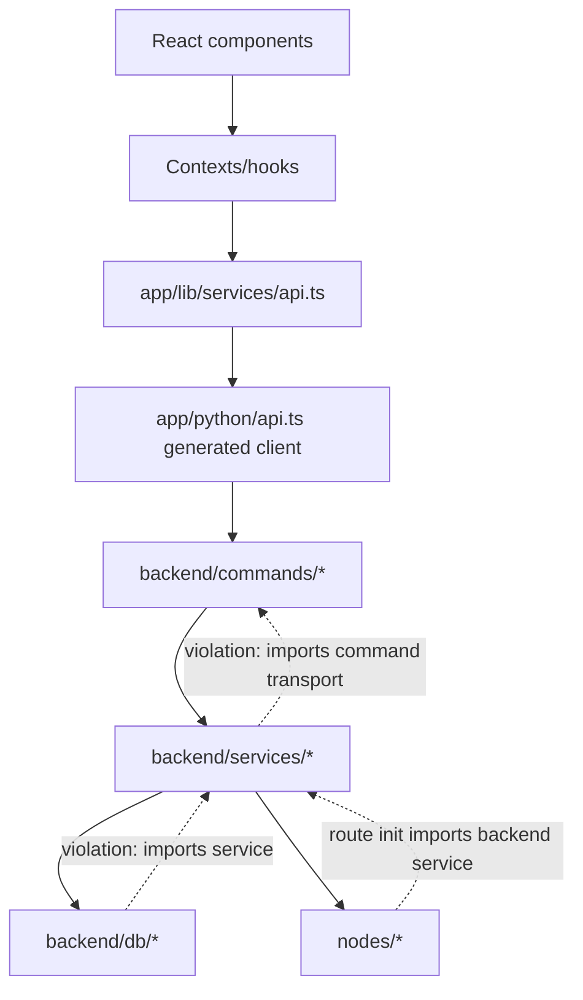

# Current Architecture Map

## Scope and Intent

This map covers the full repository as of the current code snapshot, with emphasis on:

- Runtime architecture across web + desktop + backend
- Major feature sets and where they live
- Data flow for chat streaming and tool execution
- Storage/state ownership
- Where separation of concerns currently breaks down

## Repo Topology (What Each Area Owns)

| Area | Responsibility | Key Paths |
| --- | --- | --- |
| Next.js frontend | App shell, chat UX, flow editor, settings, toolset management, artifact rendering | `app/`, `app/(app)/`, `app/components/`, `app/contexts/` |
| Python backend | API command surface, orchestration runtime, persistence, provider/tool execution | `backend/commands/`, `backend/services/`, `backend/db/`, `backend/providers/` |
| Node runtime plugin system | Graph node definitions (TS) + executors (Python) | `nodes/_registry.ts`, `nodes/_registry.py`, `nodes/**` |
| Transport bridge (vendored) | Decorators, routing, SSE/WebSocket, TS client generation | `zynk/` |
| Tool SDK | `@tool` decorator + execution context for toolset functions | `covalt-toolset/src/covalt_toolset/` |
| Desktop shell | Electrobun main process, backend process management, desktop packaging | `src/bun/index.ts`, `electrobun.config.ts` |
| Integration and characterization tests | Backend runtime, flow graph behavior, stream/toolset e2e | `tests/`, `tests/e2e/toolset-suite.ts` |
| Examples and docs | Toolset examples + design docs | `examples/`, `docs/` |
| Marketing site | Separate Vite app, not part of runtime product path | `website/` |

## System Runtime Topology

## Frontend Feature Map

| Feature Set | Core Files |
| --- | --- |
| Chat workspace (messages, input, artifacts, tools) | `app/(app)/page.tsx`, `app/components/ChatPanel.tsx`, `app/components/ChatInputForm.tsx`, `app/lib/hooks/use-chat-input.ts` |
| Agent graph editor + test chat | `app/(app)/(pages)/agents/edit/page.tsx`, `app/components/flow/canvas.tsx`, `app/lib/flow/use-flow-runner.tsx`, `app/contexts/agent-editor-context.tsx` |
| Agents CRUD | `app/(app)/(pages)/agents/page.tsx`, `app/(app)/(pages)/agents/CreateAgentDialog.tsx` |
| Toolsets + MCP server management | `app/(app)/(pages)/toolsets/page.tsx`, `app/(app)/(pages)/toolsets/InstalledPanel.tsx`, `app/components/mcp/server-form-dialog.tsx` |
| Settings (providers/model/system prompt/appearance) | `app/(app)/(pages)/settings/page.tsx`, `app/(app)/(pages)/settings/providers/ProvidersPanel.tsx`, `app/(app)/(pages)/settings/providers/ProviderRegistry.ts` |
| Artifact rendering | `app/components/ToolCallRouter.tsx`, `app/components/tool-renderers/**`, `app/contexts/artifact-panel-context.tsx` |

## Backend Bounded Contexts

| Context | Responsibility | Core Modules |
| --- | --- | --- |
| Chat runtime | Streamed chat, user/assistant message lifecycle, cancel + approvals | `backend/commands/streaming.py`, `backend/commands/branches.py`, `backend/services/chat_graph_runner.py` |
| Graph/flow execution | Node scheduling, runtime context, edge normalization/materialization | `backend/services/flow_executor.py`, `backend/services/graph_runtime.py`, `backend/services/graph_normalizer.py` |
| Tools/MCP/toolsets | Tool resolution/execution, MCP server lifecycle, render plan generation | `backend/services/tool_registry.py`, `backend/services/toolset_executor.py`, `backend/services/mcp_manager.py`, `backend/services/toolset_manager.py` |
| Providers/models | Provider adapters, model schema/options, validation and model instantiation | `backend/providers/__init__.py`, `backend/providers/*.py`, `backend/services/model_factory.py`, `backend/services/option_validation.py` |
| OAuth | MCP OAuth + provider OAuth flows | `backend/services/oauth_manager.py`, `backend/services/provider_oauth_manager.py`, `backend/commands/provider_oauth.py` |
| Workspace/files | Attachment ingest, workspace snapshots/manifests, file storage | `backend/services/chat_attachments.py`, `backend/services/workspace_manager.py`, `backend/services/file_storage.py` |
| Agent registry/routes | Agent graph storage, route indexing, webhook and node HTTP routes | `backend/services/agent_manager.py`, `backend/services/node_route_index.py`, `backend/services/http_routes.py` |

## Critical Flow A: Chat Streaming (Request to Persisted Events)

## Critical Flow B: Tool Execution to Render Plan

## Persistence and State Ownership

### SQLite (`backend/db/models.py`)

- Chat/message state: `chats`, `messages`
- Runtime stream/execution state: `active_streams`, `execution_runs`, `execution_events`
- Provider/model/settings: `provider_settings`, `models`, `user_settings`
- Tooling: `toolsets`, `toolset_files`, `tools`, `tool_overrides`, `toolset_mcp_servers`, `tool_calls`
- Workspace and auth: `workspace_manifests`, `oauth_tokens`, `provider_oauth_credentials`
- Agent graphs: `agents`

### Filesystem state (`db/` root in dev)

- Chat workspace + blobs: `db/chats/<chatId>/workspace`, `db/chats/<chatId>/blobs`
- Pending uploads: `db/pending_uploads`
- Toolset payloads: `db/toolsets/<toolsetId>`
- Agent assets: `db/agents/<agentId>`

### In-memory runtime state

- Active run lifecycle: `backend/services/run_control.py`
- Stream subscriptions/recent event replay: `backend/services/stream_broadcaster.py`
- Node route index cache: `backend/services/node_route_index.py`

## Layering as Implemented (Not as Intended)

Observed violations include:

- DB module importing service logic (`backend/db/chats.py` -> `workspace_manager`)
- Service module importing command transport (`backend/services/toolset_executor.py` -> `backend/commands/events.py`)
- Side-effect registration/import boot path (`backend/main.py`, `backend/commands/__init__.py`, `nodes/_registry.py`)

## Major Separation-of-Concerns Hotspots

- Large orchestration files combining transport, domain, persistence, and event mapping:
  - `backend/services/chat_graph_runner.py` (~2898 lines)
  - `backend/services/mcp_manager.py` (~1029 lines)
  - `backend/services/provider_oauth_manager.py` (~1136 lines)
  - `backend/commands/streaming.py` (~774 lines)
- Frontend orchestration mixed into UI components/hooks:
  - `app/components/ChatInputForm.tsx` (~726 lines)
  - `app/lib/hooks/use-chat-input.ts` (~764 lines)
  - `app/components/mcp/server-form-dialog.tsx` (~738 lines)
  - `app/(app)/(pages)/settings/providers/ProvidersPanel.tsx` (~610 lines)

## Architectural Risks to Track

- Dual source for `zynk` (dependency + vendored path override in `backend/main.py`) can drift
- Duplicate theme systems (`app/contexts/theme-context.tsx` and `app/lib/theme-provider.tsx`)
- Duplicate WebSocket client implementations (`app/python/api.ts` `EventsSocket` vs `app/contexts/websocket-context.tsx`)
- Frontend provider registry (`ProviderRegistry.ts`) is a large static catalog parallel to backend provider definitions

For a full duplication inventory and unification plan, see `docs/architecture/redundancy-and-soc-audit.md` and `docs/architecture/refactor-blueprint.md`.
